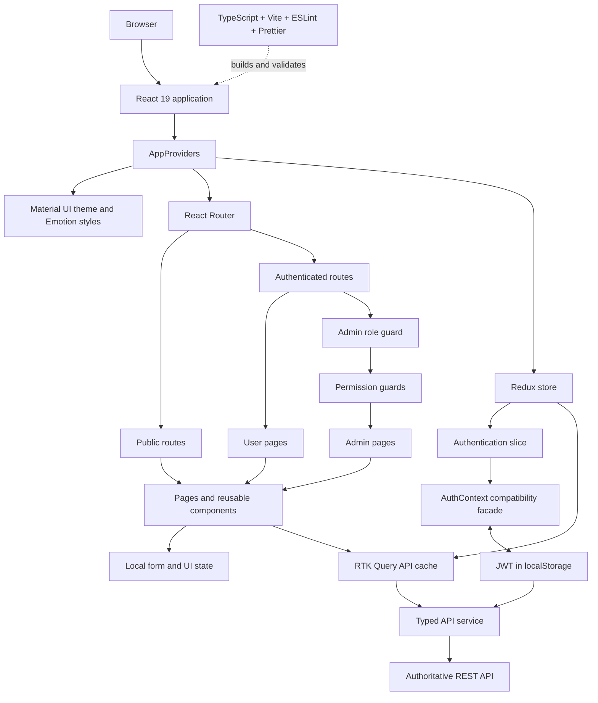

# Frontend

React 19 and TypeScript single-page application for Rishta By Aggarwal. See the
[root README](../README.md) for setup, checks, build, and deployment.

## High-level design



## File structure

```text
src/
├── app/          # Provider composition, application shell, and routes
├── assets/       # Bundled images and static assets
├── components/
│   ├── atom/     # Small reusable UI primitives
│   └── molecule/ # Auth guards, layouts, and composed UI blocks
├── constants/    # Routes, permissions, breakpoints, and theme tokens
├── context/      # Shared React context state
├── hooks/        # Reusable React hooks
├── pages/
│   ├── public/   # Home, authentication, contact, and public content
│   ├── user/     # Authenticated user profile and settings
│   └── admin/    # Permission-controlled administration screens
├── services/     # Backend API client and token handling
├── store/        # Redux slices, RTK Query endpoints, and typed hooks
├── styles/       # Shared style definitions
└── types/        # API and domain TypeScript contracts
```

## Main libraries

| Library           | Role                                             |
| ----------------- | ------------------------------------------------ |
| React / React DOM | UI and component lifecycle                       |
| Redux Toolkit     | Shared state, RTK Query cache, and API mutations |
| React Redux       | Typed React bindings for the Redux store         |
| React Router      | Client routing and nested access guards          |
| Material UI       | Components, responsive theme, and design tokens  |
| Emotion           | Material UI styling engine                       |
| TypeScript        | Static type checking                             |
| Vite              | Development server and production bundling       |
| ESLint / Prettier | Code quality and formatting                      |

## Development

```bash
npm run dev
npm run lint
npm run lint:fix
npm run format
npm run format:check
```
